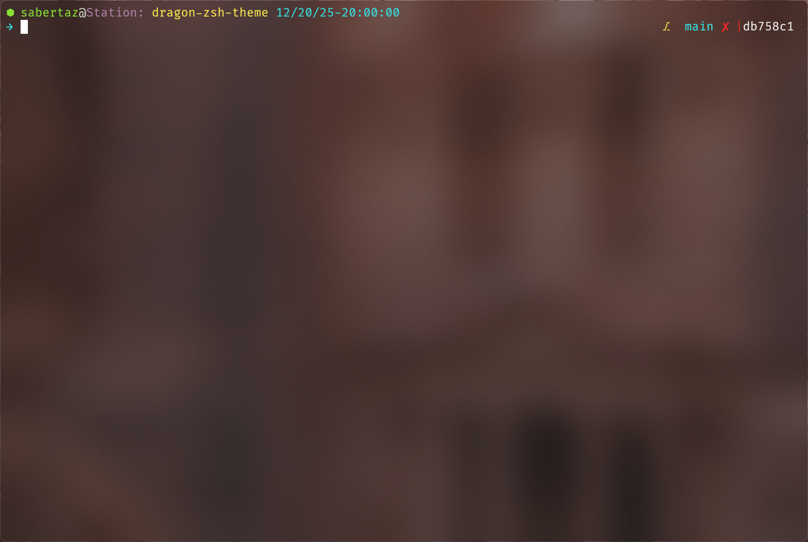
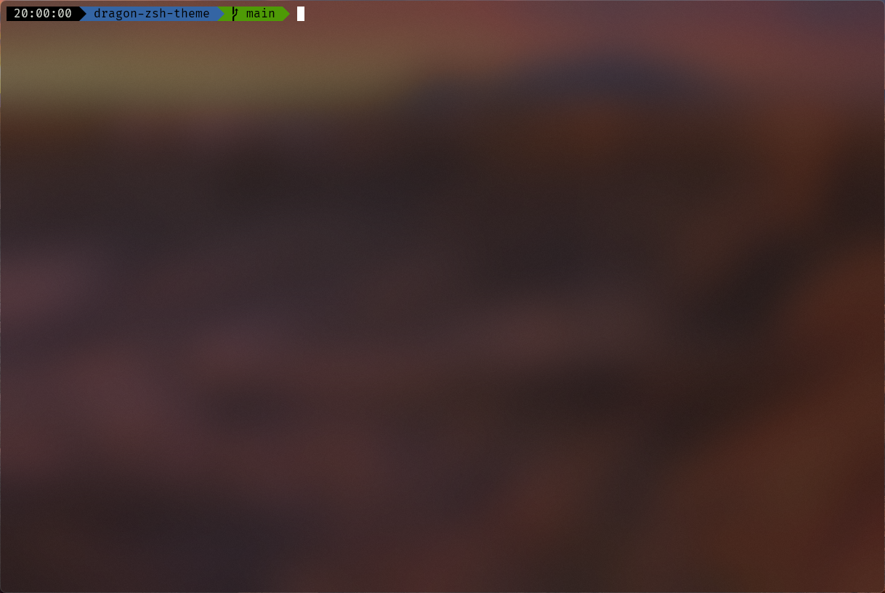

# dotfiles

[](https://github.com/sabertazimi)
[](https://raw.githubusercontent.com/sabertazimi/dotfiles/main/LICENSE)
[](https://github.com/sabertazimi/dotfiles)

[](https://github.com/archlinux)
[](https://github.com/niri-wm/niri)
[](https://github.com/gnome)
[](https://github.com/kde)
[](https://github.com/rust-lang/rust)
[](https://github.com/golang/go)
[](https://github.com/git/git)
[](https://github.com/ghostty-org/ghostty)
[](https://github.com/ohmyzsh/ohmyzsh)
[](https://github.com/ohmybash/oh-my-bash)
[](https://github.com/starship/starship)
[](https://github.com/rime)
[](https://github.com/mpv-player/mpv)

Hackable personal dotfiles managed with [chezmoi](https://github.com/twpayne/chezmoi).

## Installation

Set up new machine:

```bash
sudo pacman -S chezmoi
chezmoi init --apply -v sabertazimi
```

```bash
git clone https://github.com/sabertazimi/dotfiles.git ~/dotfiles
```

See [Arch Linux setup guide](https://notes.tazimi.dev/programming/linux/arch)
for detailed system configuration.

## Configured Applications

### Development

- **Cargo**: Rust package manager with USTC mirror
- **Go**: Go environment config file
- **Ripgrep**: Enhanced search with web file types
- **Git**: Conventional commit templates

### Terminal & Shell

- **Zsh**: Oh My Zsh with modern CLI tools (mise, zoxide, fzf, starship)
- **Ghostty**: Modern Wayland terminal with dankcolors theme
- **Starship**: Dynamic prompt via matugen (Material You theming)

### Utilities

- **MPV**: Hardware-accelerated video player
- **Satty**: Wayland screenshot annotation tool
- **Fcitx5-Rime**: Chinese input with vertical candidates and dark theme

### Themes

- **Matugen**: Material You color scheme generator from wallpaper

## Wallpapers

Collection of wallpaper management scripts for Arch Linux:

- Interactive or command-line usage
- Automatic package installation
- Copies Arch Linux, GNOME, and KDE Plasma wallpapers
- `.jxl` to `.png` conversion for GNOME wallpapers
- Resolution priority selection for KDE Plasma wallpapers

```bash
# Make scripts executable
chmod +x ~/dotfiles/wallpapers/*.sh

# Run interactive menu
~/dotfiles/wallpapers/install.sh

# Or run specific script
~/dotfiles/wallpapers/install.sh all        # All wallpapers
~/dotfiles/wallpapers/install.sh archlinux  # Arch Linux wallpapers
~/dotfiles/wallpapers/install.sh gnome      # GNOME wallpapers
~/dotfiles/wallpapers/install.sh kde        # KDE Plasma wallpapers
```

Wallpapers are copied to `~/.local/share/wallpapers/`.

Requirements:

- ImageMagick (for GNOME `.jxl` conversion)
- `archlinux-wallpaper`
- `gnome-backgrounds`
- `plasma-workspace-wallpapers`

## Shell Themes

### Zsh Theme

Minimalistic zsh prompt theme for git users:

```bash
mkdir -p ~/.oh-my-zsh/custom/themes
cp ~/dotfiles/themes/zsh/dragon.zsh-theme ~/.oh-my-zsh/custom/themes/
sed -i 's/^ZSH_THEME=".*"/ZSH_THEME="dragon"/' ~/.zshrc
source ~/.zshrc
```



### Bash Theme

Minimalistic bash prompt theme for git-bash on Windows:

```bash
mkdir -p ~/.oh-my-bash/custom/themes/dragon
cp ~/dotfiles/themes/bash/dragon.theme.sh ~/.oh-my-bash/custom/themes/dragon/
sed -i 's/^OSH_THEME=".*"/OSH_THEME="dragon"/' ~/.bashrc
source ~/.bashrc
```



## Caveats

Dotfiles not synced:

- `~/.gitconfig`, `~/.claude.json`, `~/.claude/settings.json` — contain keys and dynamically generated content
- `~/.config/niri/config.kdl`, `~/.config/DankMaterialShell/settings.json`, `~/.local/state/DankMaterialShell/session.json` — lengthy configuration files that are rarely modified, edited via `sed -i` instead of syncing to ensure new machines initialize to the corresponding version

## License

MIT License Copyright (c) [Sabertaz](https://github.com/sabertazimi)

## Contact

[](https://github.com/sabertazimi)
[](mailto:sabertazimi@gmail.com)
[](https://x.com/sabertazimi)
